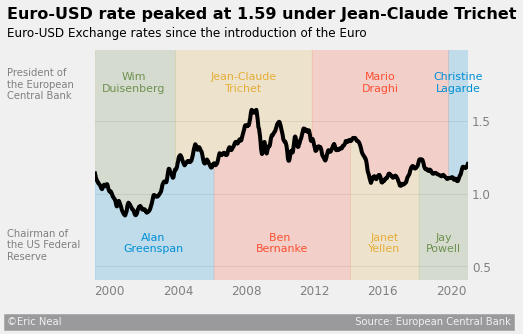

# Exchange Rates
Using data from [Kaggle](https://www.kaggle.com/datasets/lsind18/euro-exchange-daily-rates-19992020), I create a 538-style plot of the Euro-USD exchange rate. I also include on the plot the current President of the European Central Bank, and the current Chairman of the US Federal Reserve, to visualize their impact on the exchange rate. 

## Summary
- Clean data to remove null values, convert dates to DateTime objects, and isolate the Euro-USD column
- Generate and plot the rolling mean of the exchange rate
- Add the current President of the European Central Bank and the current Chairman of the US Federal Reserve to the plot

## Result
Below is `exchange_rate_plot.png`, the final visualization:

